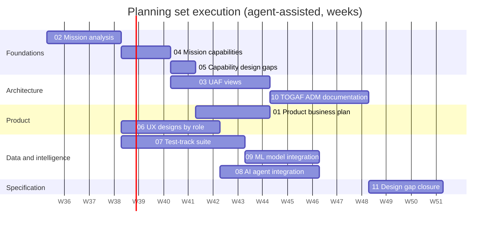

# Gungnir planning set

Eleven plans, one per deliverable set, each saying what will be produced, where it will
live under `docs/`, how it will be produced, who owns which parts, what "done" means,
and what is still undecided. The plans are the work orders; the deliverables they
describe are produced by executing them, plan by plan, in the order below.

Decisions applied to every plan (confirmed 2026-09-04):

| Decision | Choice |
|---|---|
| Market | Defense first (licensed C2 software plus integration services for NATO, allied nations, and primes), commercial counter-UAS for critical infrastructure second |
| Primary mission | Integrated air defense and counter-UAS lead; maritime and land supporting; intelligence and planning as cross-cutting functions |
| Architecture tooling | Markdown plus PlantUML and Mermaid in the repository, with a text-based element registry so UAF and TOGAF content share one model |
| AI and ML runtime | Claude API in connected profiles, open-weight local models in disconnected and air-gapped profiles, behind one provider trait; ML inference through ONNX Runtime in Rust |
| Scope | Locked 2026-09-04 (D-01): everything ships in one release through increment 4; the register in `../mission/gap-analysis/` is the work list. Plan 01 records the revenue consequence and asks whether to revisit it (D-B2) |
| Hosting | GitHub at `https://github.com/WayneRoessling/gungnir`, GitHub Actions, and the GitHub Container Registry (D-10, amended 2026-09-07); the eight workflows under `.github/workflows/` stay where they are, `gpu-fusion.yml` needs a self-hosted `gpu` runner, and GAP-061 starts with the initial commit |
| Further decisions | D-02 to D-18 (credentials, rules, budgets, roles, releasability, fires, agreements, sources, `uuid`, vocabulary, anomaly home, assistant egress, delegation, open targets, docking, and the API transport stack) recorded in `../mission/gap-analysis/decisions-needed.md` |

## The plans

| # | Plan | Produces | Target folder |
|---|---|---|---|
| 01 | [Product business plan](01-product-business-plan.md) | Business plan, market and competitive analysis, pricing, financial model, go-to-market, roadmap | `docs/business/` |
| 02 | [Mission analysis](02-mission-analysis.md) | Mission characterization for air, maritime, land, intelligence, and planning; mission threads; vignettes; measures of effectiveness | `docs/mission/` |
| 03 | [UAF views](03-uaf-views.md) | Unified Architecture Framework 1.2 views across the strategic, operational, services, personnel, resources, security, projects, standards, information, and actual-resources domains | `docs/architecture/uaf/` |
| 04 | [Mission capabilities](04-mission-capabilities.md) | Capability taxonomy, capability statements with measures, capability-to-thread and capability-to-crate traceability, capability roadmap | `docs/mission/capabilities/` |
| 05 | [Mission and technical capability design gaps](05-capability-design-gaps.md) | Gap register, coverage matrices, prioritized closing actions | `docs/mission/gap-analysis/` |
| 06 | [UX designs by role](06-ux-design-by-role.md) | Personas, task analyses, information architecture, wireframes per role, interaction design, design system, usability test plan | `docs/ux/` |
| 07 | [Test-track suite](07-test-track-suite.md) | Vehicle catalogue, kinematic class profiles, sensor models, scenario library, data format, generator and validation method | `docs/test-tracks/` and `testdata/tracks/` |
| 08 | [AI agent integration](08-ai-agent-integration.md) | Agent concept of operations, architecture, UI and services integration, evaluation, security | `docs/ai/` |
| 09 | [ML model integration](09-ml-model-integration.md) | Use cases, architecture, data pipeline, training and evaluation, MLOps, UI integration, security | `docs/ml/` |
| 10 | [TOGAF ADM documentation](10-togaf-adm-documentation.md) | Preliminary phase through Phase H plus requirements management, the Architecture Definition Document, and the architecture repository | `docs/architecture/togaf/` |
| 11 | [Design gap closure](11-design-gap-closure.md) | A design note per open design gap: owning component, types, edges, behaviour, configuration and interface delta, panel delta, and the verification row | `docs/design/` |

Each target folder already exists with a README that points back to its plan, so
deliverables have a home from the first draft.

## Execution status

| Plan | Status |
|---|---|
| 02 Mission analysis | First draft complete 2026-09-04 (13 documents under `docs/mission/`); **approved by the mission subject-matter expert 2026-09-05**. The assumptions listed in `mission-analysis.md` §11 were approved as they stand rather than individually re-derived |
| 04 Mission capabilities | First draft complete 2026-09-04 (taxonomy of 56 leaves, statements, both matrices, roadmap, measures catalogue under `docs/mission/capabilities/`; capability list seeded into the UAF registry); targets and maturity levels await the owner |
| 05 Capability design gaps | First draft complete 2026-09-04 (76 gaps then, 83 after plans 09 and 10, 84 after plan 11, and 85 after the tick harness measured GAP-085 on 2026-09-05; coverage matrix, technical gap map, closure roadmap under `docs/mission/gap-analysis/`; `ARCHITECTURE.md` §10 points at the register). The five documents are **generated** by `docs/mission/gap-analysis/tools/gen_gaps.py`, which was moved into the repository on 2026-09-05 from a session scratchpad: edit the generator, not the tables; decisions D-01 to D-16 resolved with the owner on 2026-09-04 (measure targets recorded in `docs/mission/measures.md` and the measures catalogue); severity and effort await the engineering reviewer |
| 03 UAF views | First draft complete 2026-09-04 (registry of ten element kinds, 62 views under `docs/architecture/uaf/` including 10 generated process and 10 scenario views, five traceability matrices, generator and consistency check, render scripts, CI job); operational and strategic content awaits the owner, resource content the engineering reviewer; diagrams not yet rendered |
| 06 UX designs by role | First draft complete 2026-09-04 (personas, eight task analyses, information architecture with 20 panels, 28 Salt wireframes, eight flows, design system, accessibility, usability test plan with one heuristic walkthrough, code map under `docs/ux/`; GAP-071 to GAP-075 filed; D-17 docking and multi-window resolved 2026-09-04: adopted where appropriate); principles and personas await the owner and reviewers; **round 1 with end users was begun 2026-09-05 and is not complete** -- it does not yet cover one participant per role and has produced no per-round report, so MOP-37 remains unset and GAP-074 stays open |
| 07 Test-track suite | First draft complete 2026-09-04 (58 platforms in 30 classes with sources and confidence marks, class profiles, 13 sensor models, ten scenarios TT-01 to TT-10, data format, reference generator, validator, and ten validated sample sets under `testdata/tracks/samples/` that replay through the ingest gateway in CI; GAP-076 in progress since 2026-09-05 -- its benchmark-input half is done, the fuzz corpus and the end-to-end replay are not -- and GAP-046 in progress); **the vehicle catalogue and class profiles were approved by the mission subject-matter expert 2026-09-05** |
| 01 Product business plan | First draft complete 2026-09-04 (plan, market analysis, competitive landscape, pricing, go-to-market, financial model with a 196-formula spreadsheet, roadmap, risk register, open questions under `docs/business/`); decisions D-B1, D-B3, D-B4, D-B7 answered (United States, cold start, commercial line sized only, seed of 1.5 to 3.0 million); no market number reviewed, no price validated, no counsel consulted |
| 09 ML model integration | First draft complete 2026-09-04 (nine documents under `docs/ml/`: two use cases in depth, ML-01 classification and ML-04 anomaly detection, with three more outlined; the `gungnir-ml` architecture; the dataset pipeline; training in a separate repository with a feature-extractor parity test; three promotion gates and eight proposed verification rows; UI integration; the model-governance gap; security). GAP-077 to GAP-080 filed; no model trained and no runtime signed off |
| 08 AI agent integration | First draft complete 2026-09-04 (eleven files under `docs/ai/`: an index plus concept of operations, safety boundaries, the `gungnir-agent` architecture, seventeen read-only and draft-only tools, provider configuration, model selection, UI and services integration, evaluation with seven injection cases, and the threat model). Three open questions answered: the loop runs in our process, after-action drafting runs on the node in batch, and the local model size classes. GAP-044 carries the whole build; the security reviewer has not seen it |
| 10 TOGAF ADM documentation | First draft complete 2026-09-04 (twenty-three documents under `docs/architecture/togaf/`: seventeen principles and seventeen contracts, the tailored method with nine deliverables omitted or merged, the repository and governance framework, a maturity assessment, phases A through H, fifty-eight identified requirements, the Architecture Definition Document, and a DoDAF cross-reference). The first compliance assessment ran against the code: six checks passed, two findings filed as GAP-081 and GAP-082, plus GAP-083 for requirement traceability. **Principles and contracts signed by the owner 2026-09-05**, in four TOGAF batches, each checked against the code first; five findings recorded at signature rather than resolved before it, including that AP-16's merge gate has no mechanism while the workspace is not under version control. C-07 and C-11 were run against the tree that day and both passed |
| 11 Design gap closure | Complete 2026-09-05 (22 design notes and 4 consolidations under `docs/design/`). The four register corrections were approved and applied. Design coverage moved from 30 of 56 capabilities to 52; 23 gaps retyped Mission to Technical because they are now designed; 5 new dependency edges proposed and checked acyclic. Signed off the same day: all five human-owned notes DN-08, DN-09, DN-10, DN-17, DN-22; option B for the one breaking change (schema version 2, path `/v2`, no mirror); and all 23 verification rows, now agreed criteria in `docs/verification-capability-table.md` §2. Reviewed 2026-09-05: the engineering reviewer accepted all five dependency edges and a domain reviewer checked each note against its thread step. The set is fully signed and reviewed, and **all twenty-two notes were implemented the same day**: 340 passing tests, all five approved dependency edges in manifests and drawn in `ARCHITECTURE.md` §7.1, and the schema-version-2 migration landed. Three type placements moved during implementation, each recorded in the note that assumed otherwise |

All eleven plans have been executed: ten have first drafts as of 2026-09-04, and plan 11
was completed, signed, reviewed, and implemented on 2026-09-05. None of the ten first-draft
sets has been through the reviews each one names: no subject-matter validation of the mission
content, no usability session with participants, no engineering sign-off on severity and
effort, no second reader on any market figure, no counsel on the regulatory position, and no
security review of the assistant. The status lines above say which review each set is waiting
for; plan 11 is the exception, and its line says which reviews it passed. One of those
reviews closed on 2026-09-05: the mission subject-matter expert approved the plan 02
mission content and the plan 07 vehicle data. Round 1 of the usability testing was begun
the same day but is not complete, so plan 06's review remains open. The rest need people
who have not yet been engaged: a second reader on the business figures, counsel on the
regulatory position, and a security review of the assistant.

## Implementation after the plans

The plans are documents; what follows them is the Technical half of the register. The
first tranche landed on 2026-09-05 and is recorded in `ARCHITECTURE.md` §10 items 27 to
30: `gungnir-coord`, the `gungnir-core` motion models, the five-scenario generator in
`gungnir-scenario`, and the desktop tick harness. Four `verification-capability-table.md`
§1 rows moved from specified-but-untested to a running gate, GAP-016, GAP-056, and
GAP-076 moved to In progress, and GAP-085 was filed for the one budget the new harness
showed failing. GAP-041 moved from I4 to I2 by the owner's decision the same day. This is
implementation, not a plan, so it has no row in the table above; the register and
`ARCHITECTURE.md` §10 are where it is tracked.

## Sequencing

The dependencies that drive that order:

- Mission analysis (02) is the source for capabilities (04), which is the source for the
  gap analysis (05), the UAF operational and strategic views (03), and the UX task
  analyses (06).
- The business plan (01) uses the mission analysis for the customer problem, the gap
  register for the roadmap, and the UX work for the product story.
- UAF views (03) supply the architecture content that the TOGAF phases B, C, and D
  (10) reference rather than duplicate.
- The test-track suite (07) needs the mission vignettes (02) and produces the labelled
  data the ML plan (09) trains on.
- The AI agent (08) needs the UX role designs (06) for where it appears, and the API
  transport (`ARCHITECTURE.md` §10) for the node-side agent; the desktop-side agent
  can proceed before that.
- Design gap closure (11) reads the register (05), the capability statements (04), the
  panels (06), and the principles and contracts (10), and specifies the increment-3 and
  increment-4 work packages. No engineering waits on it finishing; every increment-3 work
  package waits on the part of it that covers that package.

## Effort summary

Agent-assisted person-days, meaning one person directing coding and writing agents,
with the human-owned reviews noted in each plan. Drafts, not commitments.

| Plan | Days | Human-owned share |
|---|---|---|
| 01 Business plan | 8 to 12 | Financial assumptions, legal and export-control positions, pricing |
| 02 Mission analysis | 10 to 15 | Doctrine interpretation, threat characterization, SME validation |
| 03 UAF views | 15 to 25 | View selection, operational content sign-off |
| 04 Mission capabilities | 5 to 8 | Capability statements and measures |
| 05 Capability design gaps | 4 to 6 | Severity and priority calls |
| 06 UX designs by role | 12 to 20 | Persona validation, usability sessions |
| 07 Test-track suite | 20 to 30 | Vehicle data vetting, plausibility review, sourcing policy |
| 08 AI agent integration | 15 to 25 | Safety boundaries, data-egress policy, red-team review |
| 09 ML model integration | 12 to 20 | Use-case selection, promotion thresholds |
| 10 TOGAF ADM documentation | 20 to 30 | Principles, governance, architecture contracts |
| 11 Design gap closure | 10 to 16 | Every dependency edge; the authority, releasability, and key-management notes |
| Total | 131 to 207 | |

## Conventions every plan follows

- **Structure.** Purpose; scope; inputs; deliverables and target location; deliverable
  outline; method; roles; dependencies; effort and sequencing; acceptance criteria;
  risks; open questions.
- **Source of truth.** Where a plan restates something the code or an existing document
  owns (the dependency graph, pass criteria, the open-items list), it cites the owner
  rather than copying it. `ARCHITECTURE.md` §10 stays the open-items ledger; gaps found
  by plan 05 are added there when they are technical.
- **Diagrams.** PlantUML for structural and behavioural diagrams, Mermaid for simple
  flows, Salt (PlantUML) for wireframes; sources live next to the Markdown and render
  in the repository.
- **Element registry.** `docs/architecture/uaf/model/` holds the single list of
  capabilities, operational activities, performers, resources, services, and standards
  that UAF views, TOGAF documents, the capability taxonomy, and the gap register all
  reference by identifier, so the same thing has one name everywhere.
- **Classification and sourcing.** Everything is unclassified and built from open
  sources; plan 07 carries the sourcing policy in detail. Nothing in these documents may
  be derived from controlled or proprietary third-party material.
- **Human-owned content.** Each plan names the sections a human must write or approve.
  Agents draft everything else and keep the documents in sync with the code, following
  `CONTRIBUTING.md`.

## Assumptions to confirm

- The executing team is one lead directing agents, with subject-matter reviewers
  available on request for doctrine, UX sessions, and vehicle data.
- Eight roles: the five in `gungnir-security` (operator, supervisor, analyst, sensor
  manager, administrator) plus intelligence analyst, planner, and commander, adopted on
  2026-09-04 (D-05); the code change is GAP-068.
- The test-track suite covers platforms of both belligerents in the Russia-Ukraine war,
  kinematics and coarse signature class only, from open sources.
- "Gungnir" is a working name; trademark and product naming are business-plan open
  questions.
